# Use Case Diagram
## RPL (Recognition of Prior Learning) Application System

**Author:** Boniface Kabaso
**Date:** March 2026
**Assignment:** Assignment 5

---

## Use Case Diagram (Mermaid)

```mermaid
flowchart TB
    %% Actors
    Student(["👤 Student"])
    Assessor(["👤 Academic Assessor"])
    Registrar(["👤 Registrar"])
    InstAdmin(["👤 Institution Administrator"])
    ITAdmin(["👤 IT Administrator"])
    Helpdesk(["👤 Helpdesk Staff"])

    %% System boundary
    subgraph RPL_System["RPL Application System"]
        UC1["Register / Login"]
        UC2["Submit RPL Application"]
        UC3["Upload Supporting Documents"]
        UC4["Track Application Status"]
        UC5["Receive Notifications"]
        UC6["Review Application"]
        UC7["Request Additional Information"]
        UC8["Approve / Reject Application"]
        UC9["Manage Users and Roles"]
        UC10["Configure Workflows and Modules"]
        UC11["Generate Reports"]
        UC12["View Audit Logs"]
        UC13["View Application Status (Helpdesk)"]
        UC14["Prevent Duplicate Applications"]
    end

    %% Student associations
    Student --> UC1
    Student --> UC2
    Student --> UC4
    Student --> UC5

    %% Include relationships
    UC2 -->|"«include»"| UC3
    UC2 -->|"«include»"| UC14

    %% Extend relationships
    UC4 -->|"«extend»"| UC5

    %% Assessor associations
    Assessor --> UC1
    Assessor --> UC6
    Assessor --> UC7
    Assessor --> UC8

    %% Include
    UC6 -->|"«include»"| UC8

    %% Registrar associations
    Registrar --> UC1
    Registrar --> UC11
    Registrar --> UC12

    %% Institution Admin associations
    InstAdmin --> UC1
    InstAdmin --> UC10
    InstAdmin --> UC11

    %% IT Admin associations
    ITAdmin --> UC1
    ITAdmin --> UC9
    ITAdmin --> UC12

    %% Helpdesk associations
    Helpdesk --> UC1
    Helpdesk --> UC13

    %% Generalization - Admin roles extend base login
    UC9 -->|"«extend»"| UC1
```

---

## Written Explanation

### Key Actors and Their Roles

| Actor | Role in the System |
|-------|--------------------|
| **Student** | The primary user. Registers, submits RPL applications, uploads documents, and tracks application status. |
| **Academic Assessor** | Reviews submitted applications, requests additional information when needed, and records approval or rejection decisions. |
| **Registrar** | Oversees the entire RPL process, generates reports, and maintains audit logs for compliance. |
| **Institution Administrator** | Configures system workflows, manages available modules/qualifications, and sets academic periods and deadlines. |
| **IT Administrator** | Manages user accounts and roles, monitors system health, and views audit logs for security purposes. |
| **Helpdesk Staff** | Looks up student application status in read-only mode to answer student queries without modifying any data. |

---

### Relationships Between Actors and Use Cases

**«include» Relationships (mandatory sub-behaviours):**
- **Submit RPL Application «include» Upload Supporting Documents** — A student cannot submit an application without attaching evidence documents. Document upload is a mandatory part of the submission process.
- **Submit RPL Application «include» Prevent Duplicate Applications** — Every time a student attempts to submit, the system automatically checks for an existing active application for the same module. This is always executed as part of submission.
- **Review Application «include» Approve / Reject Application** — An assessor reviewing an application must always conclude with a formal decision. The decision step is inseparable from the review.

**«extend» Relationships (optional or conditional behaviours):**
- **Track Application Status «extend» Receive Notifications** — While students can actively track their status on the dashboard, notifications are also triggered automatically when status changes, extending the tracking experience passively.
- **Manage Users and Roles «extend» Register / Login** — Administrative user management extends the base authentication use case by adding the ability to create, modify, and deactivate accounts.

---

### How the Diagram Addresses Stakeholder Concerns from Assignment 4

| Stakeholder Concern (Assignment 4) | Use Case(s) Addressing It |
|------------------------------------|---------------------------|
| Students find paper forms time-consuming | UC2 – Submit RPL Application (digital, online) |
| No way to track application progress | UC4 – Track Application Status |
| Risk of duplicate applications | UC14 – Prevent Duplicate Applications |
| Assessors need organised, centralised view | UC6 – Review Application |
| Assessors need to request more evidence | UC7 – Request Additional Information |
| Registrar needs reports and audit trails | UC11 – Generate Reports; UC12 – View Audit Logs |
| IT Admin needs to manage users securely | UC9 – Manage Users and Roles |
| Helpdesk needs read-only status visibility | UC13 – View Application Status (Helpdesk) |
| Institution needs configurable workflows | UC10 – Configure Workflows and Modules |

---

*Document prepared for Assignment 5 — RPL Application System*
*Author: Boniface Kabaso | March 2026*
